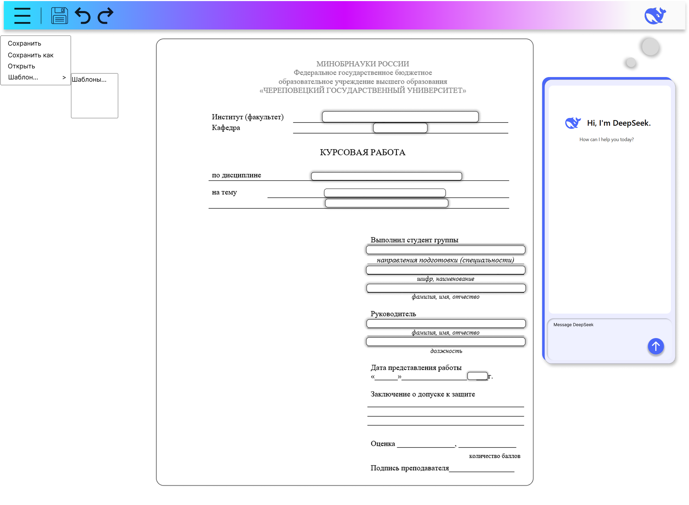
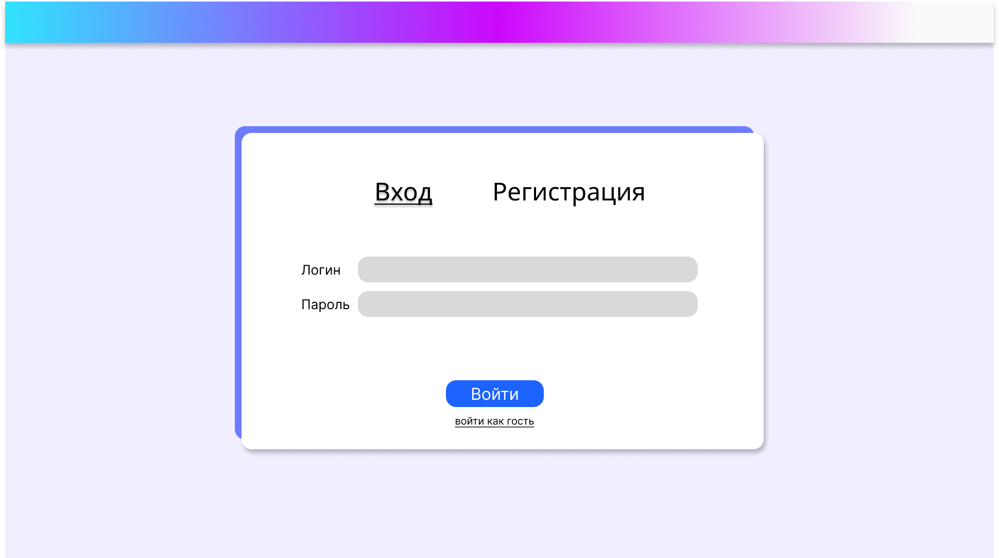

# CSharpSevenMaslyat
## Команда er: Семеро Маслят

- [Микуцких Григорий](https://github.com/Dr-Hartmann) - тимлид, проектировщик, сборщик; 
- [Белоус Глеб](https://github.com/Sindy101) - фротненд, интерфейс и страницы;
- [Тихомиров Владислав](https://github.com/GONEVladd20) - фронтенд, локализация (опционально) и редактирование docx-документа;
- [Харламов Денис](https://github.com/den12325) - бэкенд, контроллеры (OpenAPI), сервисы;
- [Остапенко Степан](https://github.com/Seelane) - бэкенд, контроллеры, нейросеть (опционально);
- [Маслов Владислав](https://github.com/Saifor) - БД, котекст и миграции;
- [Новиков Игорь](https://github.com/Forguebeelov) - БД, сущности/модели, логирование (опционально), сервисы.

---
## Стек
Архитектуры – MVC и MVVM.

| Фронтенд           | Бэкенд                    | БД                                    |
| :----------------- | :------------------------ | :------------------------------------ |
| Белоус, Тихомиров  | Остапенко, Харламов       | Маслов, Новиков                       |
| _Blazor_           | _RestAPI_, DTO-классы  | _PostgreSQL_, _Entity Framework Core_ |
| **Blazor Web App** | OpenAPI (Swagger)         | Способ работы с БД: **Code first**    |

---
## Компетенции
- **.NET** (C#)
- **ASP.NET Core MVC**
- **SOLID**
- паттерн Внедрение зависимостей (**Dependency Injection**) 
- **асинхронное программирование** и токены отмены (**Cancellation Token**)

---
**Примерные сущности для БД:**
- Пользователь (Id, Никнейм, Логин, Пароль, Лист_id_Пользовательских_Документов)
- Шаблон (Id, Имя, Файл_docx)
- Пользовательский_Документ (Id, Имя, Id_Шаблона, Файл_json_заполненных_тегов_шаблона) - теги будут выглядеть примерно так: {{title}}, {{student}}, {{group}} {{teacher}}, {{year}}...

---
## Общие указания по разработке
- валидация данных на каждом слое

---
## Условия разработки
1. Основная среда разработки: **Visual Studio**.
2. Удалённая работа для всех, кроме тимлида, есть возможность задавать вопросы очно.
3. GitHub: работа в **своих** отдельных ветках, сборка некоторого результата в **development**, релизная версия в **main**.
4. Коммиты: каждые 2 недели обязательно, спрос поимённо.

---
## Опорная идея
_**Составитель курсовой работы/отчёта по требованиям кафедры МПО ЭВМ.**_

_Тип приложения: браузерное._

_Пользователь может:_
+ _зарегистрироваться как гость, пользователь или админ,_
+ _вводить содержание в текстовые блоки (менять форматирование нельзя),_
+ _создавать разделы, заголовки, пункты, подпункты и т.д.,_
+ _скачивать свой файл, сохранаять сессию в базе данных,_

_Важные моменты интерфейса:_
- _страница личного кабинета (логин, пароль, хранилище до 10 своих документов),_
- _страница выбора шаблона документа,_
- _страница редактора документа, панель инструментов_,
- _кнопка локализации на несколько языков (Русский, English, 中文, O'zbek; опционально),_
- _нейросеть (опционально)._

_Выходной формат: .docx- и .odt-файл._

_В базе данных хранятся:_
- _данные зарегистрированных пользователей (удаление неактивных?),_
- _до 5 своих документов в хранилище (не целиком файл, а сущностями в БД)._

---
## Желаемый результат
Использование приложения студентами кафедры МПО ЭВМ.

---
## Этапы разработки
1. ✔️ ~~Создание проекта в Git~~
2. ✔️ ~~Изучение своих технологий.~~
3. ✔️ ~~Разработка Mockups интерфейса.~~
4. ✔️ ~~Написание ТЗ.~~
5. ✔️ ~~Выполнить ознакомительные задания по своим технологиям.~~
6. ❌ ~~Сверстать макет интерфейса, запрограммировать ввод данных от Клиента в БД.~~ 
7. 💅 ~~Создать MVP (ориентировочно середина апреля).~~
8. Создать новый MVP, описывающий весь основной функционал Сервера.
9. Создать настоящее приложение, решающее поставленную задачу (ёжик плакал, кололся, но продолжал есть кактус).
10. Создать логотип (опционально).
11. Провести локальное тестирование по кафедре (желательно).
12. Выступление (презентация + видео или очная демонстрация).
13. Написать и сдать РПЗ (**≈**20 страниц, где около половины совпадает у всех, а остальное - индивидуально).

---
Минута молчания перед следующими проектами 🫡:
- MvpProjectV1 - старался быть похожим на настоящее приложение, но не смог (похлопаем по плечу в знак уважения)
- MvpProjectV2 и MvpProjectV3 - так и не увидели свет...
- MVPv4 - был похож на приложение, но сервер был клиентом, а клиент... он с нами в одной комнате?
- _comming soon_
